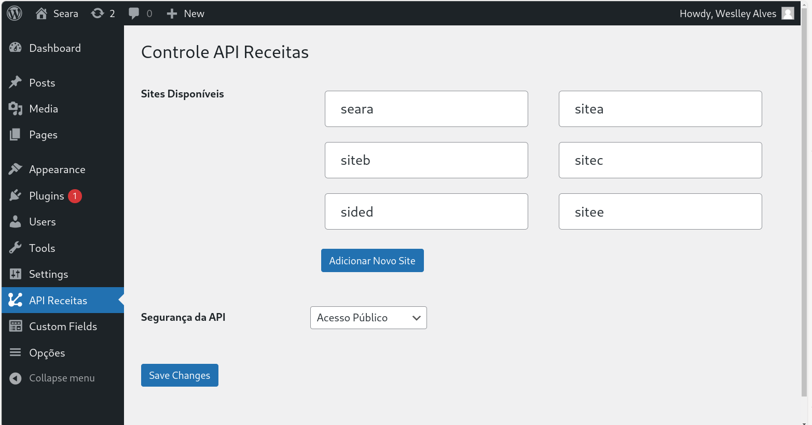
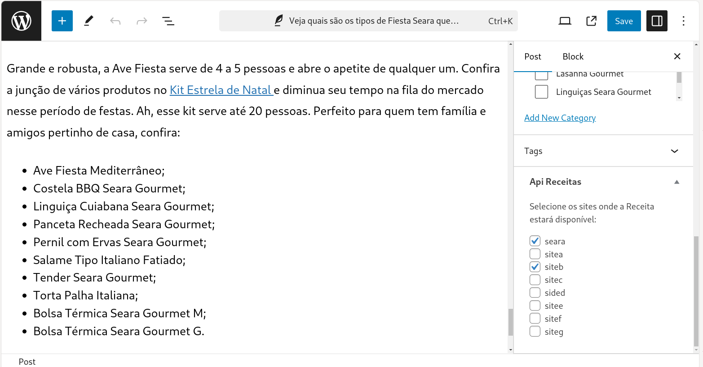

# Documentação do Plugin

## 1. Visão Geral

Este documento descreve a instalação e configuração do plugin **Recipes API**, criado para gerenciar receitas via API no WordPress.

### Repositório

- **Repositório GitHub:** [https://github.com/wezoalves/wp-api-custom](https://github.com/wezoalves/wp-api-custom)
- **Download do Plugin:** [Baixar Zip](https://github.com/wezoalves/wp-api-custom/archive/refs/heads/main.zip)

## 2. Instalação

1. **Baixar o Zip**: Baixe o plugin utilizando o link fornecido acima.
2. **Instalação no WordPress**:
    - Vá até o painel do WordPress em **Plugins > Adicionar Novo**.
    - Clique em **Enviar Plugin** e selecione o arquivo `.zip` baixado.
    - Ative o plugin após a instalação.

3. **Configurar Permalinks**:
    - Após a ativação do plugin, acesse a página de **Permalinks** em `/wp-admin/options-permalink.php` e clique em **Salvar** para que o WordPress reconheça as novas rotas adicionadas.

## 3. Configurações do Plugin

### Arquivo Principal

O arquivo principal do plugin é o [recipes-api.php](https://github.com/wezoalves/wp-api-custom/blob/main/recipes-api.php). As linhas 18 e 19 definem o custom post type (CPT) e os campos personalizados que serão retornados no objeto JSON da API.

```php
// default
define('API_CUSTOM_CPTSLUG', 'recipes');
define('API_CUSTOM_FIELDS', ['yield', 'prep_time']);
```

### Endpoints

O endpoint principal para obter as receitas é:

```
https://yoursite.com/api/v1/recipes
```

### Redirecionamento WP-JSON

Foi configurado um redirecionamento da API padrão do WordPress (`wp-json`) para facilitar uma futura migração, caso a API precise ser movida para fora do WordPress.

## 4. Parâmetros da API

A API aceita os seguintes parâmetros:

```
https://yoursite.com/api/v1/recipes?site=sitea&categories=1,2&relation=OR&page=1&limit=100
```

- **site**: Filtra receitas por um site específico.
- **categories**: Filtra receitas por categorias específicas (IDs).
- **relation**: Define a relação entre os filtros de categorias. Pode ser `OR` ou `AND`. O padrão é `OR`.
- **page**: Define a página da listagem. O padrão é `1`.
- **limit**: Define o número de itens por página. O padrão é `10`, com um máximo de `100`.

### Comportamento Padrão

- Caso nenhum parâmetro seja informado, a API retorna todas as receitas disponíveis.
- O total de itens por página padrão é `10`, mas o máximo permitido é `100`.
- A API suporta paginação, com `page=1` sendo o padrão.

### Exemplo de Resposta

```json
{
  "query": {
    "post_type": "recipes",
    "posts_per_page": -1,
    "meta_query": [],
    "tax_query": []
  },
  "data": [
    {
      "id": 1,
      "title": "title recipe",
      "resume": "resume recipe excerpt based",
      "recipie_url": "https://site.com/page-recipie",
      "image_url": "https://site.com/page-recipie/image.png",
      "meta_yield": "Value Meta yield",
      "meta_prep_time": "Value Meta prep_time"
    }
    ...
  ],
  "status": 200
}
```

## 5. Interface Administrativa

### Menu Admin

No painel administrativo do WordPress, será adicionado um menu **API Receitas**, onde é possível definir:
- Os sites disponíveis.
- Se a API requer autenticação ou não.




### Edição de Receitas

Na tela de edição de receitas, os campos específicos do plugin aparecem no canto inferior direito.



---


Para dúvidas ou suporte:

**Weslley Alves**  
Full Stack Developer  
11 99897 0080
weslley@tonica.ag